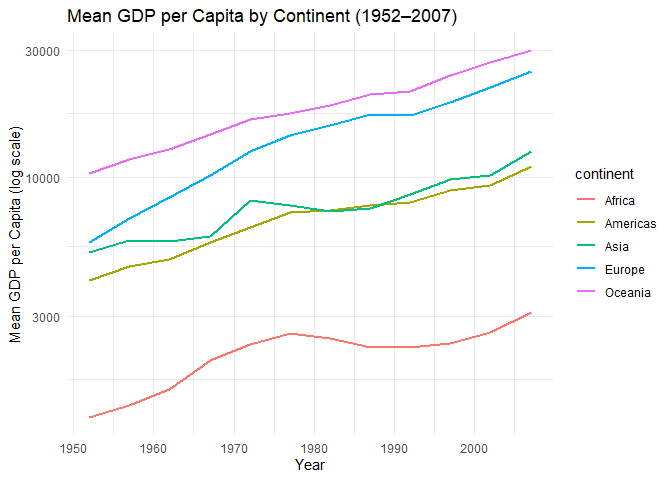

Gapminder
================
Esther Aduamah
2025-03-02

- [Grading Rubric](#grading-rubric)
  - [Individual](#individual)
  - [Submission](#submission)
- [Guided EDA](#guided-eda)
  - [**q0** Perform your “first checks” on the dataset. What variables
    are in this
    dataset?](#q0-perform-your-first-checks-on-the-dataset-what-variables-are-in-this-dataset)
  - [**q1** Determine the most and least recent years in the `gapminder`
    dataset.](#q1-determine-the-most-and-least-recent-years-in-the-gapminder-dataset)
  - [**q2** Filter on years matching `year_min`, and make a plot of the
    GDP per capita against continent. Choose an appropriate `geom_` to
    visualize the data. What observations can you
    make?](#q2-filter-on-years-matching-year_min-and-make-a-plot-of-the-gdp-per-capita-against-continent-choose-an-appropriate-geom_-to-visualize-the-data-what-observations-can-you-make)
  - [**q3** You should have found *at least* three outliers in q2 (but
    possibly many more!). Identify those outliers (figure out which
    countries they
    are).](#q3-you-should-have-found-at-least-three-outliers-in-q2-but-possibly-many-more-identify-those-outliers-figure-out-which-countries-they-are)
  - [**q4** Create a plot similar to yours from q2 studying both
    `year_min` and `year_max`. Find a way to highlight the outliers from
    q3 on your plot *in a way that lets you identify which country is
    which*. Compare the patterns between `year_min` and
    `year_max`.](#q4-create-a-plot-similar-to-yours-from-q2-studying-both-year_min-and-year_max-find-a-way-to-highlight-the-outliers-from-q3-on-your-plot-in-a-way-that-lets-you-identify-which-country-is-which-compare-the-patterns-between-year_min-and-year_max)
- [Your Own EDA](#your-own-eda)
  - [**q5** Create *at least* three new figures below. With each figure,
    try to pose new questions about the
    data.](#q5-create-at-least-three-new-figures-below-with-each-figure-try-to-pose-new-questions-about-the-data)

*Purpose*: Learning to do EDA well takes practice! In this challenge
you’ll further practice EDA by first completing a guided exploration,
then by conducting your own investigation. This challenge will also give
you a chance to use the wide variety of visual tools we’ve been
learning.

<!-- include-rubric -->

# Grading Rubric

<!-- -------------------------------------------------- -->

Unlike exercises, **challenges will be graded**. The following rubrics
define how you will be graded, both on an individual and team basis.

## Individual

<!-- ------------------------- -->

| Category | Needs Improvement | Satisfactory |
|----|----|----|
| Effort | Some task **q**’s left unattempted | All task **q**’s attempted |
| Observed | Did not document observations, or observations incorrect | Documented correct observations based on analysis |
| Supported | Some observations not clearly supported by analysis | All observations clearly supported by analysis (table, graph, etc.) |
| Assessed | Observations include claims not supported by the data, or reflect a level of certainty not warranted by the data | Observations are appropriately qualified by the quality & relevance of the data and (in)conclusiveness of the support |
| Specified | Uses the phrase “more data are necessary” without clarification | Any statement that “more data are necessary” specifies which *specific* data are needed to answer what *specific* question |
| Code Styled | Violations of the [style guide](https://style.tidyverse.org/) hinder readability | Code sufficiently close to the [style guide](https://style.tidyverse.org/) |

## Submission

<!-- ------------------------- -->

Make sure to commit both the challenge report (`report.md` file) and
supporting files (`report_files/` folder) when you are done! Then submit
a link to Canvas. **Your Challenge submission is not complete without
all files uploaded to GitHub.**

``` r
library(tidyverse)
```

    ## ── Attaching core tidyverse packages ──────────────────────── tidyverse 2.0.0 ──
    ## ✔ dplyr     1.1.4     ✔ readr     2.1.5
    ## ✔ forcats   1.0.0     ✔ stringr   1.5.1
    ## ✔ ggplot2   3.5.1     ✔ tibble    3.2.1
    ## ✔ lubridate 1.9.4     ✔ tidyr     1.3.1
    ## ✔ purrr     1.0.2     
    ## ── Conflicts ────────────────────────────────────────── tidyverse_conflicts() ──
    ## ✖ dplyr::filter() masks stats::filter()
    ## ✖ dplyr::lag()    masks stats::lag()
    ## ℹ Use the conflicted package (<http://conflicted.r-lib.org/>) to force all conflicts to become errors

``` r
library(gapminder)
```

*Background*: [Gapminder](https://www.gapminder.org/about-gapminder/) is
an independent organization that seeks to educate people about the state
of the world. They seek to counteract the worldview constructed by a
hype-driven media cycle, and promote a “fact-based worldview” by
focusing on data. The dataset we’ll study in this challenge is from
Gapminder.

# Guided EDA

<!-- -------------------------------------------------- -->

First, we’ll go through a round of *guided EDA*. Try to pay attention to
the high-level process we’re going through—after this guided round
you’ll be responsible for doing another cycle of EDA on your own!

### **q0** Perform your “first checks” on the dataset. What variables are in this dataset?

``` r
## TASK: Do your "first checks" here!
glimpse(gapminder)
```

    ## Rows: 1,704
    ## Columns: 6
    ## $ country   <fct> "Afghanistan", "Afghanistan", "Afghanistan", "Afghanistan", …
    ## $ continent <fct> Asia, Asia, Asia, Asia, Asia, Asia, Asia, Asia, Asia, Asia, …
    ## $ year      <int> 1952, 1957, 1962, 1967, 1972, 1977, 1982, 1987, 1992, 1997, …
    ## $ lifeExp   <dbl> 28.801, 30.332, 31.997, 34.020, 36.088, 38.438, 39.854, 40.8…
    ## $ pop       <int> 8425333, 9240934, 10267083, 11537966, 13079460, 14880372, 12…
    ## $ gdpPercap <dbl> 779.4453, 820.8530, 853.1007, 836.1971, 739.9811, 786.1134, …

``` r
summary(gapminder)
```

    ##         country        continent        year         lifeExp     
    ##  Afghanistan:  12   Africa  :624   Min.   :1952   Min.   :23.60  
    ##  Albania    :  12   Americas:300   1st Qu.:1966   1st Qu.:48.20  
    ##  Algeria    :  12   Asia    :396   Median :1980   Median :60.71  
    ##  Angola     :  12   Europe  :360   Mean   :1980   Mean   :59.47  
    ##  Argentina  :  12   Oceania : 24   3rd Qu.:1993   3rd Qu.:70.85  
    ##  Australia  :  12                  Max.   :2007   Max.   :82.60  
    ##  (Other)    :1632                                                
    ##       pop              gdpPercap       
    ##  Min.   :6.001e+04   Min.   :   241.2  
    ##  1st Qu.:2.794e+06   1st Qu.:  1202.1  
    ##  Median :7.024e+06   Median :  3531.8  
    ##  Mean   :2.960e+07   Mean   :  7215.3  
    ##  3rd Qu.:1.959e+07   3rd Qu.:  9325.5  
    ##  Max.   :1.319e+09   Max.   :113523.1  
    ## 

**Observations**:

- The variables names are: country, continent, year, life expectancy,
  population, and GDP per capital

### **q1** Determine the most and least recent years in the `gapminder` dataset.

*Hint*: Use the `pull()` function to get a vector out of a tibble.
(Rather than the `$` notation of base R.)

``` r
## TASK: Find the largest and smallest values of `year` in `gapminder`
year_max <- gapminder %>% summarize(max_year = max(year)) %>% pull(max_year)

year_min <- gapminder %>% summarize(min_year = min(year)) %>% pull(min_year)
```

Use the following test to check your work.

``` r
## NOTE: No need to change this
assertthat::assert_that(year_max %% 7 == 5)
```

    ## [1] TRUE

``` r
assertthat::assert_that(year_max %% 3 == 0)
```

    ## [1] TRUE

``` r
assertthat::assert_that(year_min %% 7 == 6)
```

    ## [1] TRUE

``` r
assertthat::assert_that(year_min %% 3 == 2)
```

    ## [1] TRUE

``` r
if (is_tibble(year_max)) {
  print("year_max is a tibble; try using `pull()` to get a vector")
  assertthat::assert_that(False)
}

print("Nice!")
```

    ## [1] "Nice!"

### **q2** Filter on years matching `year_min`, and make a plot of the GDP per capita against continent. Choose an appropriate `geom_` to visualize the data. What observations can you make?

You may encounter difficulties in visualizing these data; if so document
your challenges and attempt to produce the most informative visual you
can.

``` r
## TASK: Create a visual of gdpPercap vs continent
gapminder %>%
  filter(year == year_min) %>%
  ggplot(aes(x = continent, y = gdpPercap, color = continent)) +
  geom_jitter(width = 0.2, height = 0, alpha = 0.7) +
  scale_y_log10() +
  theme_minimal() +
  labs(
    title = "GDP per Capita by Continent (1952)",
    x     = "Continent",
    y     = "GDP per Capita (log scale)"
  )
```

<!-- -->

**Observations**:

- GDP per capita varies significantly across continents. Also, the
  scatter plot provides a clearer view of the spread of GDP per capita
  values within each continent.
- There is a wide spread of africa and the americas that span several
  orders of magnitude. Oceania and Asia also cluster low excpet for a
  few high points.

**Difficulties & Approaches**:

- Initially, I wrote a box plot, just from the fact we’ve done a bunch
  of boxplots, but then I was like colors! I looked later to see that
  there was box plots for the other graph, but I felt with the cluster
  of dots with this data, this one looks better.

### **q3** You should have found *at least* three outliers in q2 (but possibly many more!). Identify those outliers (figure out which countries they are).

``` r
## TASK: Identify the outliers from q2
gm_min <- gapminder %>% filter(year == year_min)
q1 <- quantile(gm_min$gdpPercap, 0.25)
q3 <- quantile(gm_min$gdpPercap, 0.75)
iqr <- q3 - q1
lower_bound <- q1 - 1.5 * iqr
upper_bound <- q3 + 1.5 * iqr

outliers <- gm_min %>%
  filter(gdpPercap > upper_bound) %>%  # Only high outliers per q2's plot
  select(country, continent, gdpPercap) %>%
  arrange(desc(gdpPercap))

print(outliers)
```

    ## # A tibble: 12 × 3
    ##    country        continent gdpPercap
    ##    <fct>          <fct>         <dbl>
    ##  1 Kuwait         Asia        108382.
    ##  2 Switzerland    Europe       14734.
    ##  3 United States  Americas     13990.
    ##  4 Canada         Americas     11367.
    ##  5 New Zealand    Oceania      10557.
    ##  6 Norway         Europe       10095.
    ##  7 Australia      Oceania      10040.
    ##  8 United Kingdom Europe        9980.
    ##  9 Bahrain        Asia          9867.
    ## 10 Denmark        Europe        9692.
    ## 11 Netherlands    Europe        8942.
    ## 12 Sweden         Europe        8528.

**Observations**:

- Identify the outlier countries from q2
  - Kuwait
  - USA
  - Switzerland
  - New Zealand

*Hint*: For the next task, it’s helpful to know a ggplot trick we’ll
learn in an upcoming exercise: You can use the `data` argument inside
any `geom_*` to modify the data that will be plotted *by that geom
only*. For instance, you can use this trick to filter a set of points to
label:

``` r
## NOTE: No need to edit, use ideas from this in q4 below
gapminder %>%
  filter(year == max(year)) %>%

  ggplot(aes(continent, lifeExp)) +
  geom_boxplot() +
  geom_point(
    data = . %>% filter(country %in% c("United Kingdom", "Japan", "Zambia")),
    mapping = aes(color = country),
    size = 2
  )
```

<!-- -->

### **q4** Create a plot similar to yours from q2 studying both `year_min` and `year_max`. Find a way to highlight the outliers from q3 on your plot *in a way that lets you identify which country is which*. Compare the patterns between `year_min` and `year_max`.

*Hint*: We’ve learned a lot of different ways to show multiple
variables; think about using different aesthetics or facets.

``` r
## TASK: Create a visual of gdpPercap vs continent
gapminder %>%
  filter(year %in% c(year_min, year_max)) %>%
  ggplot(aes(continent, gdpPercap)) +
  geom_jitter(aes(color = continent), alpha = 0.5, width = 0.2) +
  geom_text(
    data = . %>% filter(country %in% outliers$country),  # Use pre-defined outliers
    aes(label = country), 
    size = 3, 
    hjust = -0.1,
    vjust = 0.5
  ) +
  facet_wrap(~year) +
  scale_y_log10() +
  labs(
    title = "GDP per Capita by Continent (1952 vs. 2007)",
    subtitle = "Outliers labeled by country",
    x = "Continent",
    y = "GDP per Capita (log scale)"
  ) +
  theme_minimal()
```

<!-- -->

**Observations**:

- **Growth Patterns:**
  - **Asia** saw dramatic growth (e.g., Kuwait’s GDP dropped post-1952,
    but Japan/Singapore emerged as high-GDP nations).

  - **Africa** remained low-GDP, with no outliers in 2007.

  - **Europe** and **Oceania** maintained high GDP, though outliers
    shifted (e.g., Norway surpassed Switzerland).
- **Outliers:** In 2007, new high-GDP countries appeared (e.g., Ireland,
  Qatar), while some 1952 outliers (e.g., Kuwait) fell behind.

# Your Own EDA

<!-- -------------------------------------------------- -->

Now it’s your turn! We just went through guided EDA considering the GDP
per capita at two time points. You can continue looking at outliers,
consider different years, repeat the exercise with `lifeExp`, consider
the relationship between variables, or something else entirely.

### **q5** Create *at least* three new figures below. With each figure, try to pose new questions about the data.

``` r
## TASK: Your first graph
gapminder %>%
  group_by(continent, year) %>%
  summarize(mean_gdp = mean(gdpPercap), .groups = "drop") %>%
  ggplot(aes(year, mean_gdp, color = continent)) +
  geom_line(size = 1) +
  scale_y_log10() +
  labs(
    title = "Mean GDP per Capita by Continent (1952–2007)",
    x = "Year",
    y = "Mean GDP per Capita (log scale)"
  ) +
  theme_minimal()
```

    ## Warning: Using `size` aesthetic for lines was deprecated in ggplot2 3.4.0.
    ## ℹ Please use `linewidth` instead.
    ## This warning is displayed once every 8 hours.
    ## Call `lifecycle::last_lifecycle_warnings()` to see where this warning was
    ## generated.

<!-- -->

- **Asia** and **Europe** show steep growth post-1980, likely due to
  industrialization (Asia) and post-war recovery (Europe).
- **Africa**’s growth is flat, suggesting systemic barriers.
- **Americas** and **Oceania** grew steadily but were outpaced by Asia.

``` r
## TASK: Your second graph
gapminder %>%
  ggplot(aes(x = gdpPercap, y = lifeExp, color = continent)) +
  geom_point(alpha = 0.5) +
  scale_x_log10() +
  theme_minimal() +
  labs(title = "GDP vs Life Expectancy", y = "Life Expectancy", x = "GDP per Capita (log scale)")
```

<!-- -->

- The GDP vs. Life Expectancy plot shows a strong positive
  correlation—wealthier countries tend to have longer life expectancies.
  However, variability exists, especially at lower GDP levels, where
  some countries achieve high life expectancy despite lower income. The
  log scale helps distinguish differences among poorer nations, but
  disparities within continents remain hidden. A country-level analysis
  could provide deeper insights.

``` r
## TASK: Your third graph
gapminder %>%
  ggplot(aes(x = pop, y = lifeExp, color = continent)) +
  geom_point(alpha = 0.5) +
  scale_x_log10() +
  theme_minimal() +
  labs(title = "Life Expectancy vs Population Size", x = "Population (log scale)", y = "Life Expectancy")
```

<!-- -->

- **No Correlation:** Population size alone doesn’t predict life
  expectancy. For example:
  - Small populations (e.g., Iceland, Caribbean nations) achieve high
    life expectancy.

  - Large populations (e.g., India, China) show mid-range life
    expectancy, influenced by GDP/healthcare access.
- **Confounding Factors:** GDP (from Plot 2) and healthcare systems
  likely play larger roles than population size.
