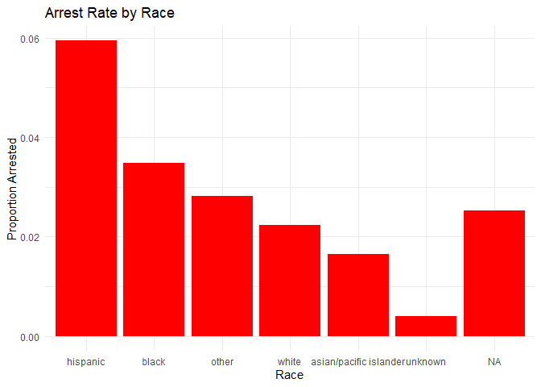
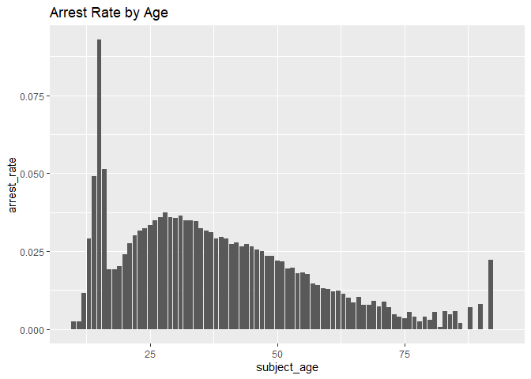
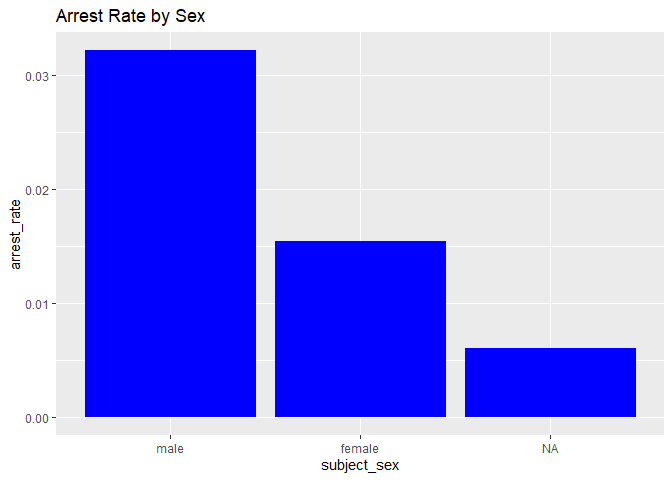
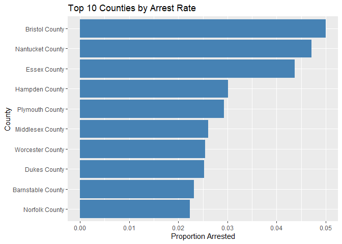
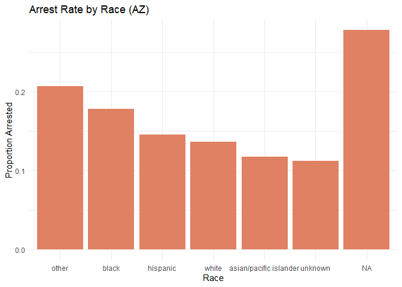
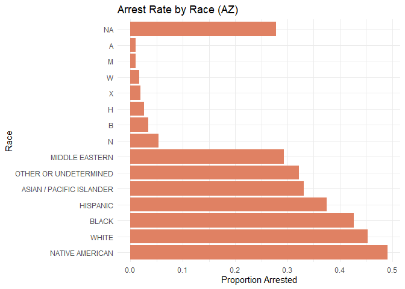

Massachusetts Highway Stops
================
Esther Aduamah
2025-04-23

- [Grading Rubric](#grading-rubric)
  - [Individual](#individual)
  - [Submission](#submission)
- [Setup](#setup)
  - [**q1** Go to the Stanford Open Policing Project page and download
    the Massachusetts State Police records in `Rds` format. Move the
    data to your `data` folder and match the `filename` to load the
    data.](#q1-go-to-the-stanford-open-policing-project-page-and-download-the-massachusetts-state-police-records-in-rds-format-move-the-data-to-your-data-folder-and-match-the-filename-to-load-the-data)
- [EDA](#eda)
  - [**q2** Do your “first checks” on the dataset. What are the basic
    facts about this
    dataset?](#q2-do-your-first-checks-on-the-dataset-what-are-the-basic-facts-about-this-dataset)
  - [**q3** Check the set of factor levels for `subject_race` and
    `raw_Race`. What do you note about overlap / difference between the
    two
    sets?](#q3-check-the-set-of-factor-levels-for-subject_race-and-raw_race-what-do-you-note-about-overlap--difference-between-the-two-sets)
  - [**q4** Check whether `subject_race` and `raw_Race` match for a
    large fraction of cases. Which of the two hypotheses above is most
    likely, based on your
    results?](#q4-check-whether-subject_race-and-raw_race-match-for-a-large-fraction-of-cases-which-of-the-two-hypotheses-above-is-most-likely-based-on-your-results)
  - [Vis](#vis)
    - [**q5** Compare the *arrest rate*—the fraction of total cases in
      which the subject was arrested—across different factors. Create as
      many visuals (or tables) as you need, but make sure to check the
      trends across all of the `subject` variables. Answer the questions
      under *observations*
      below.](#q5-compare-the-arrest-ratethe-fraction-of-total-cases-in-which-the-subject-was-arrestedacross-different-factors-create-as-many-visuals-or-tables-as-you-need-but-make-sure-to-check-the-trends-across-all-of-the-subject-variables-answer-the-questions-under-observations-below)
- [Modeling](#modeling)
  - [**q6** Run the following code and interpret the regression
    coefficients. Answer the questions under *observations*
    below.](#q6-run-the-following-code-and-interpret-the-regression-coefficients-answer-the-questions-under-observations-below)
  - [**q7** Re-fit the logistic regression from q6 setting `"white"` as
    the reference level for `subject_race`. Interpret the the model
    terms and answer the questions
    below.](#q7-re-fit-the-logistic-regression-from-q6-setting-white-as-the-reference-level-for-subject_race-interpret-the-the-model-terms-and-answer-the-questions-below)
  - [**q8** Re-fit the model using a factor indicating the presence of
    contraband in the subject’s vehicle. Answer the questions under
    *observations*
    below.](#q8-re-fit-the-model-using-a-factor-indicating-the-presence-of-contraband-in-the-subjects-vehicle-answer-the-questions-under-observations-below)
  - [**q9** Go deeper: Pose at least one more question about the data
    and fit at least one more model in support of answering that
    question.](#q9-go-deeper-pose-at-least-one-more-question-about-the-data-and-fit-at-least-one-more-model-in-support-of-answering-that-question)
  - [Further Reading](#further-reading)

*Purpose*: In this last challenge we’ll focus on using logistic
regression to study a large, complicated dataset. Interpreting the
results of a model can be challenging—both in terms of the statistics
and the real-world reasoning—so we’ll get some practice in this
challenge.

<!-- include-rubric -->

# Grading Rubric

<!-- -------------------------------------------------- -->

Unlike exercises, **challenges will be graded**. The following rubrics
define how you will be graded, both on an individual and team basis.

## Individual

<!-- ------------------------- -->

| Category | Needs Improvement | Satisfactory |
|----|----|----|
| Effort | Some task **q**’s left unattempted | All task **q**’s attempted |
| Observed | Did not document observations, or observations incorrect | Documented correct observations based on analysis |
| Supported | Some observations not clearly supported by analysis | All observations clearly supported by analysis (table, graph, etc.) |
| Assessed | Observations include claims not supported by the data, or reflect a level of certainty not warranted by the data | Observations are appropriately qualified by the quality & relevance of the data and (in)conclusiveness of the support |
| Specified | Uses the phrase “more data are necessary” without clarification | Any statement that “more data are necessary” specifies which *specific* data are needed to answer what *specific* question |
| Code Styled | Violations of the [style guide](https://style.tidyverse.org/) hinder readability | Code sufficiently close to the [style guide](https://style.tidyverse.org/) |

## Submission

<!-- ------------------------- -->

Make sure to commit both the challenge report (`report.md` file) and
supporting files (`report_files/` folder) when you are done! Then submit
a link to Canvas. **Your Challenge submission is not complete without
all files uploaded to GitHub.**

*Background*: We’ll study data from the [Stanford Open Policing
Project](https://openpolicing.stanford.edu/data/), specifically their
dataset on Massachusetts State Patrol police stops.

``` r
library(tidyverse)
```

    ## ── Attaching core tidyverse packages ──────────────────────── tidyverse 2.0.0 ──
    ## ✔ dplyr     1.1.4     ✔ readr     2.1.5
    ## ✔ forcats   1.0.0     ✔ stringr   1.5.1
    ## ✔ ggplot2   3.5.1     ✔ tibble    3.2.1
    ## ✔ lubridate 1.9.4     ✔ tidyr     1.3.1
    ## ✔ purrr     1.0.2     
    ## ── Conflicts ────────────────────────────────────────── tidyverse_conflicts() ──
    ## ✖ dplyr::filter() masks stats::filter()
    ## ✖ dplyr::lag()    masks stats::lag()
    ## ℹ Use the conflicted package (<http://conflicted.r-lib.org/>) to force all conflicts to become errors

``` r
library(broom)
```

# Setup

<!-- -------------------------------------------------- -->

### **q1** Go to the [Stanford Open Policing Project](https://openpolicing.stanford.edu/data/) page and download the Massachusetts State Police records in `Rds` format. Move the data to your `data` folder and match the `filename` to load the data.

*Note*: An `Rds` file is an R-specific file format. The function
`readRDS` will read these files.

``` r
## TODO: Download the data, move to your data folder, and load it
filename <- "./data/yg821jf8611_ma_statewide_2020_04_01.rds"
df_data <- readRDS(filename)
```

# EDA

<!-- -------------------------------------------------- -->

### **q2** Do your “first checks” on the dataset. What are the basic facts about this dataset?

``` r
glimpse (df_data)
```

    ## Rows: 3,416,238
    ## Columns: 24
    ## $ raw_row_number             <chr> "1", "2", "3", "4", "5", "6", "7", "8", "9"…
    ## $ date                       <date> 2007-06-06, 2007-06-07, 2007-06-07, 2007-0…
    ## $ location                   <chr> "MIDDLEBOROUGH", "SEEKONK", "MEDFORD", "MED…
    ## $ county_name                <chr> "Plymouth County", "Bristol County", "Middl…
    ## $ subject_age                <int> 33, 36, 56, 37, 22, 34, 54, 31, 21, 56, 56,…
    ## $ subject_race               <fct> white, white, white, white, hispanic, white…
    ## $ subject_sex                <fct> male, male, female, male, female, male, mal…
    ## $ type                       <fct> vehicular, vehicular, vehicular, vehicular,…
    ## $ arrest_made                <lgl> FALSE, FALSE, FALSE, FALSE, FALSE, FALSE, F…
    ## $ citation_issued            <lgl> TRUE, FALSE, FALSE, FALSE, TRUE, TRUE, TRUE…
    ## $ warning_issued             <lgl> FALSE, TRUE, TRUE, TRUE, FALSE, FALSE, FALS…
    ## $ outcome                    <fct> citation, warning, warning, warning, citati…
    ## $ contraband_found           <lgl> NA, FALSE, NA, NA, NA, NA, NA, NA, NA, NA, …
    ## $ contraband_drugs           <lgl> NA, FALSE, NA, NA, NA, NA, NA, NA, NA, NA, …
    ## $ contraband_weapons         <lgl> NA, FALSE, NA, NA, NA, NA, NA, NA, NA, NA, …
    ## $ contraband_alcohol         <lgl> FALSE, FALSE, FALSE, FALSE, FALSE, FALSE, F…
    ## $ contraband_other           <lgl> NA, FALSE, NA, NA, NA, NA, NA, NA, NA, NA, …
    ## $ frisk_performed            <lgl> NA, FALSE, NA, NA, NA, NA, NA, NA, NA, NA, …
    ## $ search_conducted           <lgl> FALSE, TRUE, FALSE, FALSE, FALSE, FALSE, FA…
    ## $ search_basis               <fct> NA, other, NA, NA, NA, NA, NA, NA, NA, NA, …
    ## $ reason_for_stop            <chr> "Speed", NA, NA, NA, NA, "Speed", NA, NA, N…
    ## $ vehicle_type               <chr> "Passenger", "Commercial", "Passenger", "Co…
    ## $ vehicle_registration_state <fct> MA, MA, MA, MA, MA, MA, MA, MA, MA, MA, MA,…
    ## $ raw_Race                   <chr> "White", "White", "White", "White", "Hispan…

``` r
names(df_data)
```

    ##  [1] "raw_row_number"             "date"                      
    ##  [3] "location"                   "county_name"               
    ##  [5] "subject_age"                "subject_race"              
    ##  [7] "subject_sex"                "type"                      
    ##  [9] "arrest_made"                "citation_issued"           
    ## [11] "warning_issued"             "outcome"                   
    ## [13] "contraband_found"           "contraband_drugs"          
    ## [15] "contraband_weapons"         "contraband_alcohol"        
    ## [17] "contraband_other"           "frisk_performed"           
    ## [19] "search_conducted"           "search_basis"              
    ## [21] "reason_for_stop"            "vehicle_type"              
    ## [23] "vehicle_registration_state" "raw_Race"

``` r
df_data
```

    ## # A tibble: 3,416,238 × 24
    ##    raw_row_number date       location      county_name  subject_age subject_race
    ##    <chr>          <date>     <chr>         <chr>              <int> <fct>       
    ##  1 1              2007-06-06 MIDDLEBOROUGH Plymouth Co…          33 white       
    ##  2 2              2007-06-07 SEEKONK       Bristol Cou…          36 white       
    ##  3 3              2007-06-07 MEDFORD       Middlesex C…          56 white       
    ##  4 4              2007-06-07 MEDFORD       Middlesex C…          37 white       
    ##  5 5              2007-06-07 EVERETT       Middlesex C…          22 hispanic    
    ##  6 6              2007-06-07 MEDFORD       Middlesex C…          34 white       
    ##  7 7              2007-06-07 SOMERVILLE    Middlesex C…          54 hispanic    
    ##  8 8              2007-06-07 HOPKINTON     Middlesex C…          31 hispanic    
    ##  9 9              2007-06-07 SOMERVILLE    Middlesex C…          21 white       
    ## 10 10             2007-06-06 BARNSTABLE    Barnstable …          56 white       
    ## # ℹ 3,416,228 more rows
    ## # ℹ 18 more variables: subject_sex <fct>, type <fct>, arrest_made <lgl>,
    ## #   citation_issued <lgl>, warning_issued <lgl>, outcome <fct>,
    ## #   contraband_found <lgl>, contraband_drugs <lgl>, contraband_weapons <lgl>,
    ## #   contraband_alcohol <lgl>, contraband_other <lgl>, frisk_performed <lgl>,
    ## #   search_conducted <lgl>, search_basis <fct>, reason_for_stop <chr>,
    ## #   vehicle_type <chr>, vehicle_registration_state <fct>, raw_Race <chr>

**Observations**:

- What are the basic facts about this dataset?
- All of these values are from 2007. It has a multitude fo columns
  ranging information from the location, age, and then a multitude of
  misdeeds concerning traffic stops and what they could’ve gotten in
  trouble for. Specific details include: subject’s demographics,
  location details, whether an arrest was made, whether contraband was
  found.

Note that we have both a `subject_race` and `race_Raw` column. There are
a few possibilities as to what `race_Raw` represents:

- `race_Raw` could be the race of the police officer in the stop
- `race_Raw` could be an unprocessed version of `subject_race`

Let’s try to distinguish between these two possibilities.

### **q3** Check the set of factor levels for `subject_race` and `raw_Race`. What do you note about overlap / difference between the two sets?

``` r
## TODO: Determine the factor levels for subject_race and raw_Race

df_data %>%
  summarise(
    subject_race_levels = list(unique(na.omit(subject_race))),
    raw_Race_levels = list(unique(na.omit(raw_Race)))
  ) %>% 
  glimpse()  # Shows compact view of the list columns
```

    ## Rows: 1
    ## Columns: 2
    ## $ subject_race_levels <list> <white, hispanic, black, asian/pacific islander, …
    ## $ raw_Race_levels     <list> <"White", "Hispanic", "Black", "Asian or Pacific …

``` r
# Count overlaps between columns
df_data %>%
  count(subject_race, raw_Race) %>%
  arrange(desc(n)) %>%
  print(n = 20)  # Show top 20 combinations
```

    ## # A tibble: 9 × 3
    ##   subject_race           raw_Race                                            n
    ##   <fct>                  <chr>                                           <int>
    ## 1 white                  White                                         2529780
    ## 2 black                  Black                                          351610
    ## 3 hispanic               Hispanic                                       338317
    ## 4 asian/pacific islander Asian or Pacific Islander                      102292
    ## 5 asian/pacific islander Middle Eastern or East Indian (South Asian)     64550
    ## 6 unknown                None - for no operator present citations only   17017
    ## 7 other                  American Indian or Alaskan Native               11006
    ## 8 <NA>                   <NA>                                             1664
    ## 9 other                  A                                                   2

``` r
# Matching percentage calculation
match_stats <- df_data %>%
  summarise(
    match_percent = mean(subject_race == raw_Race, na.rm = TRUE) * 100,
    total_comparable = sum(!is.na(subject_race) & !is.na(raw_Race)),
    total_mismatches = sum(subject_race != raw_Race, na.rm = TRUE)
  )
match_stats
```

    ## # A tibble: 1 × 3
    ##   match_percent total_comparable total_mismatches
    ##           <dbl>            <int>            <int>
    ## 1             0          3414574          3414574

**Observations**:

- What are the unique values for `subject_race`?
  - white, black, hispanic, asian/pacific islander, unknown, other
- What are the unique values for `raw_Race`?
  - White, Black, Hispanic, Asian or Pacific Islander, Middle Eastern or
    East Indian (South Asian), None - for no operator for present
    citation only, American Indian or Alaskan Native
- What is the overlap between the two sets?
  - The ones that are the same are: white, black, hispanic, asian or
    pacific islander and NA.
- What is the difference between the two sets?
  - The difference between the two is that Middle Eastern or East Indian
    (South Asian) in raw_Race

### **q4** Check whether `subject_race` and `raw_Race` match for a large fraction of cases. Which of the two hypotheses above is most likely, based on your results?

*Note*: Just to be clear, I’m *not* asking you to do a *statistical*
hypothesis test.

``` r
## TODO: Devise your own way to test the hypothesis posed above.

match_rate <- df_data %>%
  summarise(
    match_percent = mean(subject_race == raw_Race, na.rm = TRUE) * 100,
    total_comparable = sum(!is.na(subject_race) & !is.na(raw_Race)),
    total_mismatches = sum(subject_race != raw_Race, na.rm = TRUE)
  )

match_rate
```

    ## # A tibble: 1 × 3
    ##   match_percent total_comparable total_mismatches
    ##           <dbl>            <int>            <int>
    ## 1             0          3414574          3414574

**Observations**

Between the two hypotheses:

- `race_Raw` could be the race of the police officer in the stop
- `race_Raw` could be an unprocessed version of `subject_race`

which is most plausible, based on your results?

- race_Raw was unprocessed version.

## Vis

<!-- ------------------------- -->

### **q5** Compare the *arrest rate*—the fraction of total cases in which the subject was arrested—across different factors. Create as many visuals (or tables) as you need, but make sure to check the trends across all of the `subject` variables. Answer the questions under *observations* below.

``` r
df_data %>%
  group_by(subject_race) %>%
  summarise(arrest_rate = mean(arrest_made == TRUE, na.rm = TRUE)) %>%
  ggplot(aes(x = reorder(subject_race, -arrest_rate), y = arrest_rate)) +
  geom_col(fill = "red") +
  labs(title = "Arrest Rate by Race", x = "Race", y = "Proportion Arrested") +
  theme_minimal()
```

<!-- -->

``` r
df_data %>%
  group_by(subject_age) %>%
  summarise(arrest_rate = mean(arrest_made == TRUE, na.rm = TRUE)) %>%
  ggplot(aes(x = subject_age, y = arrest_rate)) +
  geom_col() +  # Or geom_col() for age bins
  labs(title = "Arrest Rate by Age")
```

    ## Warning: Removed 1 row containing missing values or values outside the scale range
    ## (`geom_col()`).

<!-- -->

``` r
df_data %>%
  group_by(subject_sex) %>%
  summarise(arrest_rate = mean(arrest_made == TRUE, na.rm = TRUE)) %>%
  ggplot(aes(x = subject_sex, y = arrest_rate)) +
  geom_col(fill = "blue") +
  labs(title = "Arrest Rate by Sex")
```

<!-- -->

**Observations**:

- How does `arrest_rate` tend to vary with `subject_age`?
  - According to the data set, it shows that there is an obscene amount
    of people who get arrested under the age of 25. It seems to be
    evenly split up, but there are some specific gaps of ages in the
    data set. Maybe there are some blanks
- How does `arrest_rate` tend to vary with `subject_sex`?
  - I wonder with the NA of subject_sex whether or not they may be born
    with a specific sex, but don’t identify with the gender that usually
    corresponds with the gender. It might also be that they didn’t
    consent.
  - It shows that males have higher arrest rates maybe due to biases or
    behavioral differences.
- How does `arrest_rate` tend to vary with `subject_race`?
  - It shows the Hispanic subjects have by far the highest arrest rate
    and then black subject follow afterwards. I’m confused about what
    the difference between NA and unknown and what that means. I wonder
    if geographic patterns might confound what we’re seeing.

# Modeling

<!-- -------------------------------------------------- -->

We’re going to use a model to study the relationship between `subject`
factors and arrest rate, but first we need to understand a bit more
about *dummy variables*

### **q6** Run the following code and interpret the regression coefficients. Answer the questions under *observations* below.

``` r
## NOTE: No need to edit; inspect the estimated model terms.
fit_q6 <-
  glm(
    formula = arrest_made ~ subject_age + subject_race + subject_sex,
    data = df_data %>%
      filter(
        !is.na(arrest_made),
        subject_race %in% c("white", "black", "hispanic")
      ),
    family = "binomial"
  )

fit_q6 %>% tidy()
```

    ## # A tibble: 5 × 5
    ##   term                 estimate std.error statistic   p.value
    ##   <chr>                   <dbl>     <dbl>     <dbl>     <dbl>
    ## 1 (Intercept)           -2.67    0.0132      -202.  0        
    ## 2 subject_age           -0.0142  0.000280     -50.5 0        
    ## 3 subject_racehispanic   0.513   0.0119        43.3 0        
    ## 4 subject_racewhite     -0.380   0.0103       -37.0 3.12e-299
    ## 5 subject_sexfemale     -0.755   0.00910      -83.0 0

**Observations**:

- Which `subject_race` levels are included in fitting the model?
  - When fitting the model we first filtered to only those stops where
    subject_race was one of white, black, or hispanci– so those three
    groups are the only races the model ‘saw’ during estimation.
- Which `subject_race` levels have terms in the model?
  - Because R encodes categorical predictors by choosing one level as a
    reference (here, black is the baseline), the output table shows
    dummy‐variable terms for hispanic and white only. In other words,
    you get coefficients for subject_racehispanic and subject_racewhite–
    but no explicit subject_racebalck term, since all other race effects
    are measured relative to that reference group.

You should find that each factor in the model has a level *missing* in
its set of terms. This is because R represents factors against a
*reference level*: The model treats one factor level as “default”, and
each factor model term represents a change from that “default” behavior.
For instance, the model above treats `subject_sex==male` as the
reference level, so the `subject_sexfemale` term represents the *change
in probability* of arrest due to a person being female (rather than
male).

The this reference level approach to coding factors is necessary for
[technical
reasons](https://www.andrew.cmu.edu/user/achoulde/94842/lectures/lecture10/lecture10-94842.html#why-is-one-of-the-levels-missing-in-the-regression),
but it complicates interpreting the model results. For instance; if we
want to compare two levels, neither of which are the reference level, we
have to consider the difference in their model coefficients. But if we
want to compare all levels against one “baseline” level, then we can
relevel the data to facilitate this comparison.

By default `glm` uses the first factor level present as the reference
level. Therefore we can use
`mutate(factor = fct_relevel(factor, "desired_level"))` to set our
`"desired_level"` as the reference factor.

### **q7** Re-fit the logistic regression from q6 setting `"white"` as the reference level for `subject_race`. Interpret the the model terms and answer the questions below.

``` r
## TODO: Re-fit the logistic regression, but set "white" as the reference
## level for subject_race


fit_q7 <-
  glm(
    formula = arrest_made ~ subject_age + subject_race + subject_sex,
    data = df_data %>%
      filter(
        !is.na(arrest_made),
        subject_race %in% c("white", "black", "hispanic")
        ) %>%
           mutate(subject_race = relevel(factor(subject_race), ref = "white")
                  ),
    family = "binomial"
      )

fit_q7 %>% tidy()
```

    ## # A tibble: 5 × 5
    ##   term                 estimate std.error statistic   p.value
    ##   <chr>                   <dbl>     <dbl>     <dbl>     <dbl>
    ## 1 (Intercept)           -3.05    0.0109      -279.  0        
    ## 2 subject_age           -0.0142  0.000280     -50.5 0        
    ## 3 subject_raceblack      0.380   0.0103        37.0 3.12e-299
    ## 4 subject_racehispanic   0.893   0.00859      104.  0        
    ## 5 subject_sexfemale     -0.755   0.00910      -83.0 0

**Observations**:

- Which `subject_race` level has the highest probability of being
  arrested, according to this model? Which has the lowest probability?
  - The highest probability of arrests are Hispanics and then the lowest
    probability would be white subjects.
- What could explain this difference in probabilities of arrest across
  race? List **multiple** possibilities.
  - One of the most obvious could be that there is officer bias or
    profiling as officer are more likely to escalte stops to arrest if
    the subject is black/hispanic.
  - It could also be that officers are more diligent about recording an
    arrrest for some groups, but not others, artifictually inflating
    their ‘arrest rate’.
  - It might also be that neighborhoods with higher proportions of
    Hispanic/black residents may have policing policies (or crime
    environments) that yield higher arrest rates once stopped.
- Look at the set of variables in the dataset; do any of the columns
  relate to a potential explanation you listed?
  - (Your response here) The contraband_found and search_conducted could
    speak to underlying offense severity: finding contraband almost
    always leads to an arrest. Location fields could capture
    neighborhood-level policing intensity or policy differences.

One way we can explain differential arrest rates is to include some
measure indicating the presence of an arrestable offense. We’ll do this
in a particular way in the next task.

### **q8** Re-fit the model using a factor indicating the presence of contraband in the subject’s vehicle. Answer the questions under *observations* below.

``` r
## TODO: Repeat the modeling above, but control for whether contraband was found
## during the police stop

fit_q8 <-
  glm(
    formula = arrest_made ~ subject_age
                         + subject_race
                         + subject_sex
                         + contraband_found,           # new term
    data = df_data %>%
      filter(
        !is.na(arrest_made),
        subject_race %in% c("white", "black", "hispanic")
      ) %>%
      mutate(
        subject_race     = fct_relevel(subject_race, "white"),
        contraband_found = factor(contraband_found,
                                  levels = c(FALSE, TRUE))
      ),
    family = binomial
  )

fit_q8 %>% tidy()
```

    ## # A tibble: 6 × 5
    ##   term                 estimate std.error statistic   p.value
    ##   <chr>                   <dbl>     <dbl>     <dbl>     <dbl>
    ## 1 (Intercept)           -1.72    0.0339      -50.8  0        
    ## 2 subject_age            0.0225  0.000866     26.0  2.19e-149
    ## 3 subject_raceblack     -0.0511  0.0270       -1.90 5.80e-  2
    ## 4 subject_racehispanic   0.221   0.0237        9.31 1.32e- 20
    ## 5 subject_sexfemale     -0.306   0.0257      -11.9  1.06e- 32
    ## 6 contraband_foundTRUE   0.609   0.0192       31.7  4.29e-221

**Observations**:

- How does controlling for found contraband affect the `subject_race`
  terms in the model?
  - Once you add `contraband_found` to the regression, the race
    coefficients shrink in magnitude. In other words, the log-odds
    differences for Black vs. White and Hispanic vs. White both
    decrease, which means that part of the unadjusted racial disparity
    in arrest rates is explained by differing rates of contraband
    discovery across races.
- What does the *finding of contraband* tell us about the stop? What
  does it *not* tell us about the stop?
  - Discovering contraband is a strong, direct predictor of an arrest
    (the `contraband_foundTRUE` coefficient is large and highly
    significant), reflecting that illegal items almost inevitably lead
    to charges.

  - However, it does *not* tell us *why* the vehicle was stopped (e.g.,
    traffic violation, equipment issue, officer discretion) nor does it
    capture any pre-stop decisions or potential bias in who gets
    searched.

### **q9** Go deeper: Pose at least one more question about the data and fit at least one more model in support of answering that question.

``` r
fit_q9_alt <- glm(
  arrest_made ~ county_name + subject_race + subject_sex,
  data = df_data,
  family = "binomial"
)
tidy(fit_q9_alt)
```

    ## # A tibble: 20 × 5
    ##    term                         estimate std.error statistic   p.value
    ##    <chr>                           <dbl>     <dbl>     <dbl>     <dbl>
    ##  1 (Intercept)                 -3.90       0.0289  -135.     0        
    ##  2 county_nameBerkshire County -0.363      0.0309   -11.8    6.55e- 32
    ##  3 county_nameBristol County    0.676      0.0238    28.4    4.61e-177
    ##  4 county_nameDukes County      0.0681     0.0958     0.711  4.77e-  1
    ##  5 county_nameEssex County      0.484      0.0235    20.6    1.39e- 94
    ##  6 county_nameFranklin County  -0.465      0.0338   -13.8    5.04e- 43
    ##  7 county_nameHampden County    0.0452     0.0235     1.92   5.44e-  2
    ##  8 county_nameHampshire County -0.438      0.0350   -12.5    6.98e- 36
    ##  9 county_nameMiddlesex County  0.000808   0.0231     0.0350 9.72e-  1
    ## 10 county_nameNantucket County  0.527      0.0661     7.98   1.50e- 15
    ## 11 county_nameNorfolk County   -0.186      0.0251    -7.43   1.06e- 13
    ## 12 county_namePlymouth County   0.152      0.0258     5.90   3.69e-  9
    ## 13 county_nameSuffolk County   -0.361      0.0235   -15.4    3.18e- 53
    ## 14 county_nameWorcester County -0.0298     0.0227    -1.31   1.89e-  1
    ## 15 subject_raceblack            0.747      0.0215    34.8    2.70e-265
    ## 16 subject_racehispanic         1.23       0.0207    59.3    0        
    ## 17 subject_racewhite            0.281      0.0199    14.2    1.82e- 45
    ## 18 subject_raceother            0.374      0.0660     5.67   1.47e-  8
    ## 19 subject_raceunknown         -1.49       0.268     -5.55   2.81e-  8
    ## 20 subject_sexfemale           -0.715      0.00886  -80.7    0

``` r
df_county <- df_data %>% 
  mutate(county_name = fct_lump_min(county_name, min = 50)) 

df_county %>%
  group_by(county_name) %>%
  summarise(arrest_rate = mean(arrest_made == TRUE, na.rm = TRUE)) %>%
  filter(county_name != "Other") %>%
  slice_max(arrest_rate, n = 10) %>%  # Top 10 counties
  ggplot(aes(x = fct_reorder(county_name, arrest_rate), y = arrest_rate)) +
  geom_col(fill = "steelblue") +
  coord_flip() +  # Horizontal bars for readability
  labs(
    title = "Top 10 Counties by Arrest Rate",
    x = "County",
    y = "Proportion Arrested"
  )
```

<!-- -->

**Observations**:

- Bristol County remains the top county by arrest rate, followed closely
  by Nantucket and Essex.
- Norfolk County (Needham) appears at the bottom of the top 10 list
  (10th place), not as the lowest overall in the state. Many smaller
  counties outside this top‐10 group actually have lower arrest rates
  than Norfolk.
- This nuance suggests that while Norfolk’s arrest rate is relatively
  low compared to the busiest counties, it isn’t the absolute minimum.
  It may also reflect sample‐size effects (e.g., Nantucket’s small
  number of stops can exaggerate its rate).

## Further Reading

<!-- -------------------------------------------------- -->

- Stanford Open Policing Project
  [findings](https://openpolicing.stanford.edu/findings/).

Extra for Presentation

``` r
## TODO: Download the data, move to your data folder, and load it
filename <- "./data/yg821jf8611_az_statewide_2020_04_01.rds"
df_az<- readRDS(filename)

glimpse (df_az)
```

    ## Rows: 3,498,159
    ## Columns: 29
    ## $ raw_row_number         <chr> "1", "2", "3", "4", "5", "6", "7", "8", "9", "1…
    ## $ date                   <date> 2009-01-06, 2009-01-18, 2009-01-20, 2009-01-24…
    ## $ time                   <time> 01:00:00, 01:58:00, 01:25:00, 19:52:00, 02:25:…
    ## $ location               <chr> "I10 165", "US60 185", "SR202 16", "US60 172.4"…
    ## $ county_name            <chr> "Maricopa County", "Maricopa County", "Maricopa…
    ## $ subject_race           <fct> hispanic, white, hispanic, hispanic, white, whi…
    ## $ subject_sex            <fct> male, male, male, female, female, male, female,…
    ## $ officer_id_hash        <chr> "08a56c4f70", "08a56c4f70", "08a56c4f70", "08a5…
    ## $ type                   <fct> vehicular, vehicular, vehicular, vehicular, veh…
    ## $ violation              <chr> "other moving violation", "speed", "NA", "NA", …
    ## $ arrest_made            <lgl> FALSE, FALSE, FALSE, FALSE, FALSE, FALSE, FALSE…
    ## $ citation_issued        <lgl> FALSE, FALSE, FALSE, TRUE, FALSE, FALSE, FALSE,…
    ## $ warning_issued         <lgl> TRUE, TRUE, TRUE, FALSE, TRUE, TRUE, FALSE, TRU…
    ## $ outcome                <fct> warning, warning, warning, citation, warning, w…
    ## $ contraband_found       <lgl> NA, NA, NA, NA, NA, NA, NA, NA, NA, NA, NA, NA,…
    ## $ contraband_drugs       <lgl> NA, NA, NA, NA, NA, NA, NA, NA, NA, NA, NA, NA,…
    ## $ contraband_other       <lgl> NA, NA, NA, NA, NA, NA, NA, NA, NA, NA, NA, NA,…
    ## $ search_conducted       <lgl> FALSE, FALSE, FALSE, FALSE, FALSE, FALSE, FALSE…
    ## $ search_person          <lgl> FALSE, FALSE, FALSE, FALSE, FALSE, FALSE, FALSE…
    ## $ search_vehicle         <lgl> FALSE, FALSE, FALSE, FALSE, FALSE, FALSE, FALSE…
    ## $ search_basis           <fct> NA, NA, NA, NA, NA, NA, NA, NA, NA, NA, NA, NA,…
    ## $ reason_for_stop        <chr> "Moving violation", "Moving violation", "Moving…
    ## $ vehicle_type           <chr> "12PU", "4DSD", "4DSD", "4DSD", "4DSD", "2DSD",…
    ## $ vehicle_year           <int> 2007, 2004, 2001, 2003, 2001, 2006, 1997, 2007,…
    ## $ raw_Ethnicity          <chr> "H", "W", "H", "H", "W", "W", "H", "N", "H", "H…
    ## $ raw_OutcomeOfStop      <chr> "WA", "WA", "WA", "CI", "WA", "WA", "RO", "WA",…
    ## $ raw_ReasonForStop      <chr> "H", "H", "H", "H", "H", "H", "V", "H", "H", "N…
    ## $ raw_TypeOfSearch       <chr> NA, NA, NA, NA, NA, NA, NA, NA, NA, NA, NA, NA,…
    ## $ raw_ViolationsObserved <chr> "OM", "SP", "LU", "LU", "LU", "SP", "EQ", "SP",…

``` r
names(df_az)
```

    ##  [1] "raw_row_number"         "date"                   "time"                  
    ##  [4] "location"               "county_name"            "subject_race"          
    ##  [7] "subject_sex"            "officer_id_hash"        "type"                  
    ## [10] "violation"              "arrest_made"            "citation_issued"       
    ## [13] "warning_issued"         "outcome"                "contraband_found"      
    ## [16] "contraband_drugs"       "contraband_other"       "search_conducted"      
    ## [19] "search_person"          "search_vehicle"         "search_basis"          
    ## [22] "reason_for_stop"        "vehicle_type"           "vehicle_year"          
    ## [25] "raw_Ethnicity"          "raw_OutcomeOfStop"      "raw_ReasonForStop"     
    ## [28] "raw_TypeOfSearch"       "raw_ViolationsObserved"

``` r
df_az
```

    ## # A tibble: 3,498,159 × 29
    ##    raw_row_number date       time  location county_name subject_race subject_sex
    ##    <chr>          <date>     <tim> <chr>    <chr>       <fct>        <fct>      
    ##  1 1              2009-01-06 01:00 I10 165  Maricopa C… hispanic     male       
    ##  2 2              2009-01-18 01:58 US60 185 Maricopa C… white        male       
    ##  3 3              2009-01-20 01:25 SR202 16 Maricopa C… hispanic     male       
    ##  4 4              2009-01-24 19:52 US60 17… Maricopa C… hispanic     female     
    ##  5 5              2009-01-25 02:25 US60 181 Maricopa C… white        female     
    ##  6 6              2009-02-01 02:08 HOLMES/… <NA>        white        male       
    ##  7 7              2009-03-09 21:35 US60 182 Maricopa C… hispanic     female     
    ##  8 8              2009-03-19 10:40 I10 185  Pinal Coun… other        female     
    ##  9 9              2009-04-14 19:37 SR202 19 Maricopa C… hispanic     male       
    ## 10 10             2009-05-10 20:03 SR202 1… Maricopa C… hispanic     female     
    ## # ℹ 3,498,149 more rows
    ## # ℹ 22 more variables: officer_id_hash <chr>, type <fct>, violation <chr>,
    ## #   arrest_made <lgl>, citation_issued <lgl>, warning_issued <lgl>,
    ## #   outcome <fct>, contraband_found <lgl>, contraband_drugs <lgl>,
    ## #   contraband_other <lgl>, search_conducted <lgl>, search_person <lgl>,
    ## #   search_vehicle <lgl>, search_basis <fct>, reason_for_stop <chr>,
    ## #   vehicle_type <chr>, vehicle_year <int>, raw_Ethnicity <chr>, …

``` r
df_az %>%
  group_by(subject_race) %>%
  summarise(arrest_rate = mean(arrest_made == TRUE, na.rm = TRUE)) %>%
  ggplot(aes(x = reorder(subject_race, -arrest_rate), y = arrest_rate)) +
  geom_col(fill = "#e08163") +
  labs(title = "Arrest Rate by Race (AZ)", x = "Race", y = "Proportion Arrested") +
  theme_minimal()
```

<!-- -->

``` r
df_az %>%
  group_by(raw_Ethnicity) %>%
  summarise(arrest_rate = mean(arrest_made == TRUE, na.rm = TRUE)) %>%
  ggplot(aes(x = reorder(raw_Ethnicity, -arrest_rate), y = arrest_rate)) +
  geom_col(fill = "#e08163") +
  coord_flip() +
  labs(title = "Arrest Rate by Race (AZ)", x = "Race", y = "Proportion Arrested") +
  theme_minimal()
```

<!-- -->
